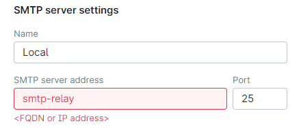
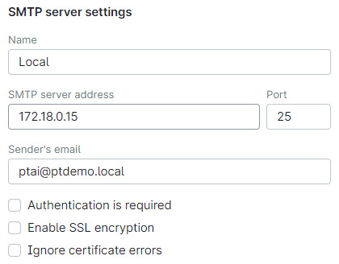
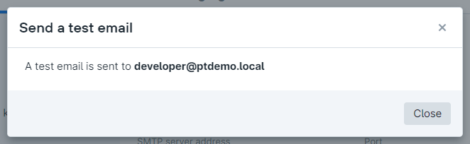

# Internal SMTP relay for PT Application Inspector
Origin: https://medium.com/@kaivanov/postfix-as-a-sasl-authenticated-tls-enabled-relay-59bcfb40b3d4

## Build SMTP relay image
### Prepare assets
As Postfix SMTP relay allows SSL protection for authentication we need to provide Docker image with certificate and private key. Get and copy these files into `assets/etc/ssl/certs/smtp-relay.pem` and `assets/etc/ssl/private/smtp-relay.key` respectively.
### Build Docker image
``` bash
# Get internal PT AI Docker network info
# Unauthenticated SMTP from that network will be enabled
# (This command is to be executed on PT AI server)
INTERNAL_NETWORK=$(docker inspect -f '{{range .IPAM.Config}}{{.Subnet}}{{end}}' ai-docker-network)

# Build Docker image:
# MAIL_SERVER_HOST: FQDN of remote SMTP server
# MAIL_SERVER_PORT: TCP port of remote SMTP server
# MAIL_SERVER_USER, MAIL_SERVER_DOMAIN and MAIL_SERVER_PASSWORD: remote SMTP server PT AI mail credentials
docker build \
  --build-arg HOSTNAME=relay.ptdemo.local \
  --build-arg MAIL_SERVER_HOST=mail.ptdemo.local \
  --build-arg MAIL_SERVER_PORT=465 \
  --build-arg MAIL_SERVER_USER=ptai \
  --build-arg MAIL_SERVER_DOMAIN=ptdemo.local \
  --build-arg MAIL_SERVER_PASSWORD=P@ssw0rd \
  --build-arg INTERNAL_NETWORK=${INTERNAL_NETWORK} \
  --tag posidev/smtp-relay .
```

## Run Docker container on PT AI server
``` bash
# Start SMTP relay container
docker run --detach \
  --restart=unless-stopped \
  --name smtp-relay \
  --network ai-docker-network posidev/smtp-relay
# Get SMTP container internal Docker network IP address
docker inspect -f '{{range.NetworkSettings.Networks}}{{.IPAddress}}{{end}}' smtp-relay
```

## Setup PT AI mail profile
SMTP relay container works in the internal PT AI network and doesn't publish any IP ports. That means that we could use container name as SMTP server address but PT AI UI checks its syntax for FQDN compatibility so we need to use Docker internal IP address.


As we set Docker internal network as trusted in Postfix settings (see `mynetworks` parameter in `main.cf` file) so there's no need to use credentials.


Check if settings are correct with "Send a test email" button:

